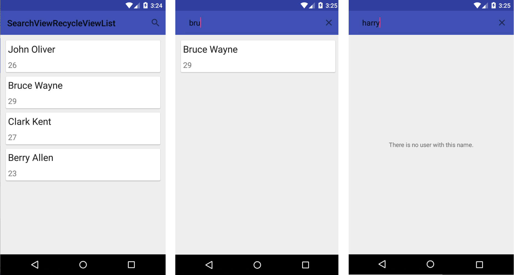

# About

 Awesome Listview filter functionality in Android.
 A simple example of using a RecycleView in Kotlin for Android.

 * Custom Adapter.
 * List in RecycleView.
 * Data Class.
 * CardView.
 * Simple and clean code.